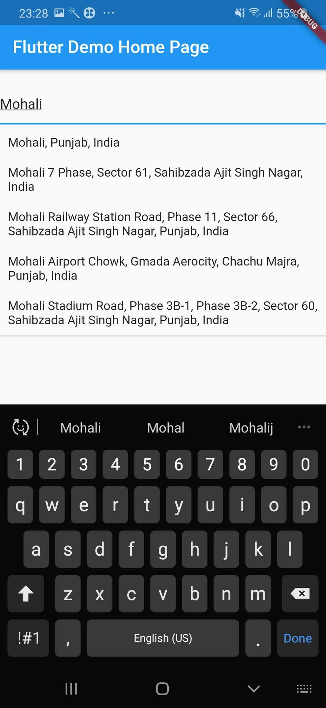

# flutter_google_places_nocors
Cloned from google_places_flutter package
WIP
# Add dependency into pubspec.yml
TBD not yet published
```
dependencies:
  flutter:
    sdk: flutter
  flutter_google_places_nocors: <last-version>
  
```  

# Google AutoComplete TextField Widget code
```
    GooglePlaceAutoCompleteTextField(
        textEditingController: controller,
        googleAPIKey: "YOUR_GOOGLE_API_KEY",
        inputDecoration: InputDecoration()
        debounceTime: 800 // default 600 ms,
        countries: ["in","fr"],// optional by default null is set
        isLatLngRequired:true,// if you required coordinates from place detail
        getPlaceDetailWithLatLng: (Prediction prediction) {
         // this method will return latlng with place detail
        print("placeDetails" + prediction.lng.toString());
        }, // this callback is called when isLatLngRequired is true
        itemClick: (Prediction prediction) {
         controller.text=prediction.description;
          controller.selection = TextSelection.fromPosition(TextPosition(offset: prediction.description.length));
        }
        // if we want to make custom list item builder
        itemBuilder: (context, index, Prediction prediction) {
          return Container(
            padding: EdgeInsets.all(10),
            child: Row(
              children: [
                Icon(Icons.location_on),
                SizedBox(
                  width: 7,
                ),
                Expanded(child: Text("${prediction.description??""}"))
              ],
            ),
          );
        }
        // if you want to add seperator between list items
        seperatedBuilder: Divider(),
        // want to show close icon 
        isCrossBtnShown: true,
        // optional container padding
         containerHorizontalPadding: 10,
         // place type
        placeType: PlaceType.geocode,
    )
```

# Customization Option
You can customize a text field input decoration and debounce time

# Screenshorts


# CORS
This package depends on flutter_google_places_sdk for "web" platform, flutter_google_places_sdk load the google api when used, but it could cause conflicts if you have already added the google api script (e.g. in index html). To avoid this you have to change the id of the script with value "flutter_google_places_sdk_web_script_id"
```html
<!-- index.html -->
  <script
    id="flutter_google_places_sdk_web_script_id"
    src="https://maps.googleapis.com/maps/api/js?key=[API_KEY]&libraries=drawing,places">
  </script>
```

